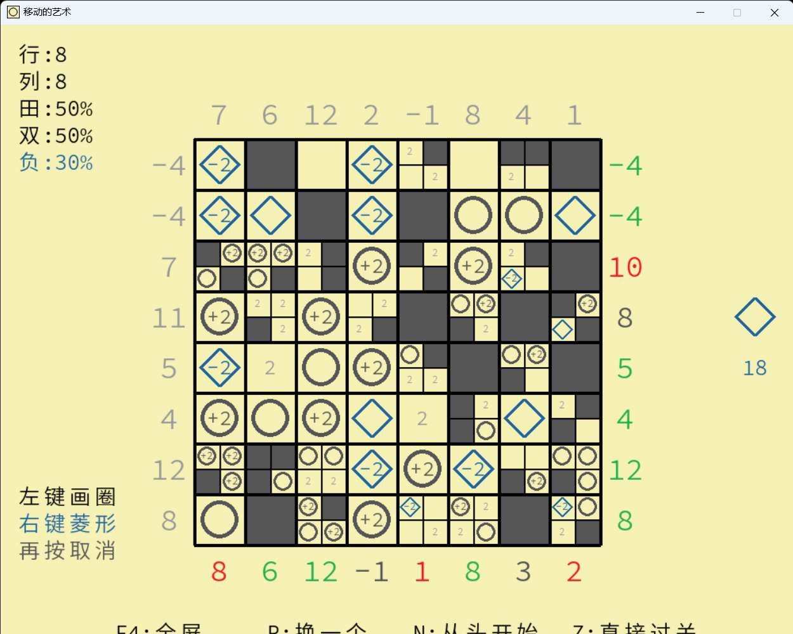

# Fill Circle

## Introduction 

You need to fill the cells with "circles" and ensure that the number of circles in each row (column) matches the requirements on the left (top).

As you progress, the map will expand, and new mechanics will be introduced. These include:

Double cells: Circles placed here will count as double.
Four-point cells: Multiple circles can be placed here.
"Blue squares": These count as negative circles. The number of "blue squares" is limited (although in my experience, this limitation doesn't seem to matter much).
In reality, this game is far from being a true puzzle. If you try to think through its solutions, you'll find it's not much more than that.

Feel free to leave comments; it's important for a beginner like me.

Enjoy your game!

## Screenshot 

