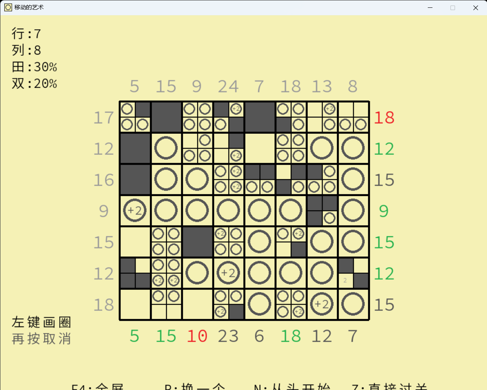

# Fill Circle

## 游戏介绍 

你在单元格中填“圈”（quan），并确保每行（列）中的圆圈数量符合左侧（顶部）的要求。

随着你的过关，地图会扩大，新的机制会被引燃，它们是下面这些：

- 双倍格子: 圆圈会有双倍的效果

- 四重格子: 有四个小格子，每个里面都可以放东西

- “蓝色方形”: 相当于负值的“圈”. “蓝色方形”的数量是有限的的（但是我没感觉这个限制有什么用）

实际上，这个游戏还远不能被称为一个谜题。如果你思考解决它的办法，你会发现他不过如此。

欢迎留言，这对我

祝你玩得愉快！

## 游戏截图 

